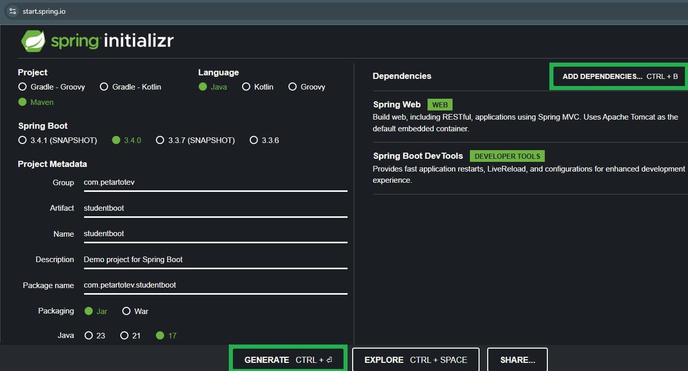
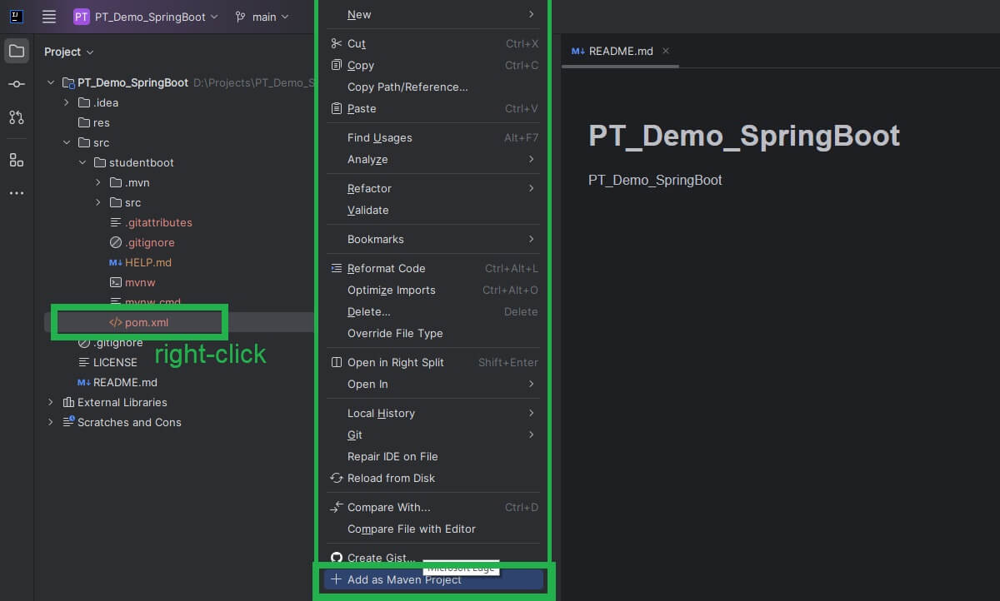
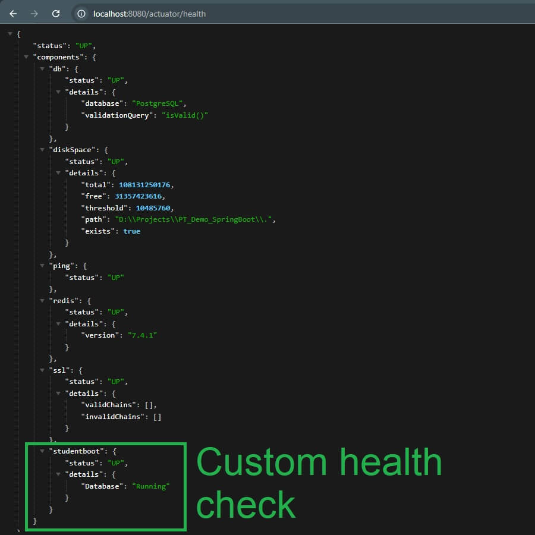

# PT_Demo_SpringBoot

PT_Demo_SpringBoot

## Contents
- [C# vs Java](#c-vs-java)
- [Setup](#setup)
    - [Prerequisites](#prerequisites)
      - [Install Maven](#install-maven)
    - [Initial Setup](#initial-setup)
    - [Simple Codebase Implementation](#simple-codebase-implementation)
    - [Unit Testing](#unit-testing)
    - [Run Application](#run-application)
- [Use Database with JDBC](#use-database-with-jdbc)
- [Use Redis](#use-redis)
- [Validation](#validation)
  - [Simple Implementation](#simple-implementation)
  - [Bean Validation Annotations in Java](#bean-validation-annotations-in-java)
  - [Custom Validation](#custom-validation)
- [Dependency Injection](#dependency-injection)
  - [Simple DI Example](#simple-di-example)
  - [Annotations in DI](#annotations-in-di)
  - [Scopes in DI](#scopes-in-di)
  - [Scopes Examples](#scopes-di-examples)
    - [Singleton](#singleton-default-scope)
    - [Prototype (Transient?)](#prototype)
    - [Request (Scoped)](#request-scope)
  - [Using Interfaces with Multiple Implementations](#using-interfaces-and-multiple-implementations)
- [Retry Mechanism using Resilience4j](#retry-mechanism-using-resilience4j-similar-to-polly-in-net)
- [Actuator](#actuator)
  - [Health Endpoint](#health-endpoint)
  - [Info Endpoint](#info-endpoint)
  - [Metrics Endpoint](#metrics-endpoint)
- [Background Jobs](#background-jobs)
  - [Synchronous Processing](#synchronous-processing)
  - [Asynchronous Processing](#asynchronous-processing)
- [Docker](#docker)
- [Known Issues](#known-issues)
  - [Port 8080 taken](#port-8080-is-already-taken)
- [Links](#links)

## TODO
1. Swagger?
2. Dependency Injection

## C# vs Java
| Feature         | C#     | Java         |
|-----------------|--------|--------------|
| Retry Mechanism | Polly  | Resilience4j |

## Setup
### Prerequisites
#### Install Maven
1. Download the latest Maven binary ZIP archive from https://maven.apache.org/download.cgi.
2. Extract the downloaded ZIP file to a directory, e.g. `C:\Program Files\Maven`. 
3. Set Environment Variables:
- Add `MAVEN_HOME`:
   - Right-click `This PC` > `Properties` > `Advanced System Settings` > `Environment Variables`.
   - Under `System Variables`, click `New`.
   - Set `Variable Name` to `MAVEN_HOME` and `Variable Value` to the path where Maven is extracted (`C:\Program Files\Maven`).
- Update `PATH`:
   - Find the Path variable under `System Variables` and click `Edit`.
   - Add `C:\Program Files\Maven\bin` (or the bin folder under the extracted Maven directory).
4. Verify installation:
```
mvn -v

Output:
  Apache Maven 3.9.9 (...)
  Maven home: ...
  Java version: 21.0.1, vendor: Oracle Corporation, runtime: ...
  Default locale: ...
  OS name: ...
```

### Initial Setup
1. Go to [Spring Initializr](https://start.spring.io/).
2. Set the following options:
- Project: `Maven`
- Language: `Java`
- Spring Boot Version: `3.1.4`
- Group: `com.petartotev`
- Artifact: `studentboot`
- Name: `studentboot`
- Description: `Some description...`
- Package Name: `com.petartotev.studentboot`
- Packaging: `Jar`
- Java Version: `17`
- Add Dependencies:
  - `Spring Web` - for building the REST API.
  - `Spring Boot DevTools` - for auto-reloading during development.
  - `Spring Boot Validation` - for request validation.
3. Click Generate to download the ZIP file.

4. Import the Project in IntelliJ IDEA:
- Unzip the file you downloaded.
- Open IntelliJ IDEA.
- Go to `File` > `New` > `Project from Existing Sources`.
- Navigate to the unzipped folder and select the `pom.xml` file.

- IntelliJ will load the project and download dependencies.

### Simple Codebase Implementation
1. In `studentboot/src/main/java/com.petartotev.studentboot`:
- Create package `model` and implement model `Student.java`.
- Create package `repository` and implement `StudentRepository.java`.
- Create package `controller` and implement `StudentController.java`.
2. (Optional) In `studentboot/src/main/resources/application.properties`, add port configuration:
```
server.port=8080
```

### Unit Testing
1. Add the following dependency in `pom.xml` to test the controller(s) using Spring Boot's MockMvc to mock HTTP requests:
```
<dependency>
    <groupId>org.springframework.boot</groupId>
    <artifactId>spring-boot-starter-test</artifactId>
    <scope>test</scope>
</dependency>
```
2. In `studentboot/src/test/java/com.petartotev.studentboot`:
- Create package `repository` and implement `StudentRepositoryTest`;
- Create package `controller` and implement `StudentControllerTest`.
3. In order to run all tests, either:
- `Ctrl + Shift + F10` (this didn't work for me...);
- Right click on `src/test/java` > Run `All Tests`.

### Run Application
1. Open `studentboot/src/main/java/com.petartotev.studentboot/StudentbootApplication`:
2. Run the `main()` method to start the application.
3. Finally, API should be available on [GET] http://localhost:8080/api/students. 

## Use Database with JDBC
1. Run PostgreSQL container (see PT_Demo_PostgreSQL).
2. Implement `Car` model, `CarRepository` and `CarController` similar to `Student`'s.
3. Add the following dependencies in `pom.xml`:
```
<dependency>
    <groupId>org.springframework.boot</groupId>
    <artifactId>spring-boot-starter-jdbc</artifactId>
</dependency>
<dependency>
    <groupId>org.postgresql</groupId>
    <artifactId>postgresql</artifactId>
</dependency>
```
4. In `application.properties`, add the following:
```
spring.datasource.url=jdbc:postgresql://localhost:5432/your_database_name
spring.datasource.username=your_username
spring.datasource.password=your_password
spring.datasource.driver-class-name=org.postgresql.Driver
# Optional: Enable SQL logging
spring.jpa.show-sql=true
spring.datasource.initialization-mode=always
```
5. Make sure you have the Car table created by creating `schema.sql` in resource directory with query "IF NOT EXISTS CREATE".
⚠️ WARNING: This doesn't work! I needed to create this manually by executing the query in DBeaver.
6. Refactor the Repository and Controller as it currently is.

## Use Redis
1. Run Redis in Docker Container on `localhost:6370`:
```
docker run --name redis-server -p 6379:6379 -d redis
```
2. Add the following dependency in `pom.xml`:
```
<dependency>
    <groupId>org.springframework.boot</groupId>
    <artifactId>spring-boot-starter-data-redis</artifactId>
</dependency>
```
3. Configure Redis in `application.properties`:
```
spring.redis.host=localhost
spring.redis.port=6379
```
4. Implement `Employee` model, using @RedisHash("Employee") and @Id - should be String.
5. Implement `EmployeeRepository` interface using @Repository and extending CrudRepository<Employee, String>.
6. Implement `EmployeeController` that injects `EmployeeRepository employeeRepository`.

## Validation
### Simple Implementation
1. Add the following dependencies in `pom.xml`:
```
<dependency>
  <groupId>org.springframework.boot</groupId>
  <artifactId>spring-boot-starter-validation</artifactId>
</dependency>
<dependency>
  <groupId>jakarta.validation</groupId>
  <artifactId>jakarta.validation-api</artifactId>
  <version>3.1.0</version>
</dependency>
```
2. In `Student` class, add `@NotBlank`, `@NotNull`, `@Size` annotations in order to validate the properties needed.
3. In `StudentController` class, add `@Validated` annotation on the class and `@Valid` annotation on the `@RequestBody` argument of the POST and PUT methods
4. Create `GlobalExceptionHandler` as follows:
```
package com.petartotev.studentboot;
...
@ControllerAdvice
public class GlobalExceptionHandler {
    @ExceptionHandler(MethodArgumentNotValidException.class)
    public ResponseEntity<Map<String, String>> handleValidationExceptions(MethodArgumentNotValidException ex) {
        Map<String, String> errors = new HashMap<>();
        for (FieldError error : ex.getBindingResult().getFieldErrors()) {
            errors.put(error.getField(), error.getDefaultMessage());
        }
        return new ResponseEntity<>(errors, HttpStatus.BAD_REQUEST);
    }

    @ExceptionHandler(Exception.class)
    public ResponseEntity<String> handleGenericException(Exception ex) {
        return new ResponseEntity<>("An error occurred: " + ex.getMessage(), HttpStatus.INTERNAL_SERVER_ERROR);
    }
}
```

### Bean Validation Annotations in Java
| **Annotation**         | **Description**                                                                         | **Example**                                                                                                             |
|------------------------|-----------------------------------------------------------------------------------------|-------------------------------------------------------------------------------------------------------------------------|
| `@NotNull`             | Ensures the value is not `null`.                                                        | `@NotNull(message = "Value cannot be null") private String name;`                                                       |
| `@NotBlank`            | Ensures the value is not `null` or blank (ignores whitespace). For `String` types only. | `@NotBlank(message = "Value cannot be blank") private String username;`                                                 |
| `@NotEmpty`            | Ensures the value is not `null` or empty. Works for collections, strings, arrays, etc.  | `@NotEmpty(message = "Collection cannot be empty") private List<String> items;`                                         |
| `@Size`                | Enforces size constraints for strings, collections, arrays, etc.                        | `@Size(min = 1, max = 50, message = "Name must be between 1 and 50 characters") private String name;`                   |
| `@Min`                 | Ensures the value is greater than or equal to the specified minimum.                    | `@Min(value = 18, message = "Age must be at least 18") private int age;`                                                |
| `@Max`                 | Ensures the value is less than or equal to the specified maximum.                       | `@Max(value = 100, message = "Age cannot exceed 100") private int age;`                                                 |
| `@Positive`            | Ensures the value is positive (greater than 0).                                         | `@Positive(message = "Value must be positive") private int quantity;`                                                   |
| `@PositiveOrZero`      | Ensures the value is positive or zero.                                                  | `@PositiveOrZero(message = "Value must be zero or positive") private int balance;`                                      |
| `@Negative`            | Ensures the value is negative (less than 0).                                            | `@Negative(message = "Value must be negative") private int temperature;`                                                |
| `@NegativeOrZero`      | Ensures the value is negative or zero.                                                  | `@NegativeOrZero(message = "Value must be zero or negative") private int loss;`                                         |
| `@DecimalMin`          | Ensures the value is greater than or equal to the specified minimum for decimals.       | `@DecimalMin(value = "0.01", inclusive = true, message = "Amount must be at least 0.01") private BigDecimal amount;`    |
| `@DecimalMax`          | Ensures the value is less than or equal to the specified maximum for decimals.          | `@DecimalMax(value = "100.00", inclusive = false, message = "Amount must be less than 100") private BigDecimal amount;` |
| `@Past`                | Ensures the date/time is in the past.                                                   | `@Past(message = "Date must be in the past") private LocalDate birthDate;`                                              |
| `@PastOrPresent`       | Ensures the date/time is in the past or present.                                        | `@PastOrPresent(message = "Date cannot be in the future") private LocalDate createdDate;`                               |
| `@Future`              | Ensures the date/time is in the future.                                                 | `@Future(message = "Date must be in the future") private LocalDate expiryDate;`                                         |
| `@FutureOrPresent`     | Ensures the date/time is in the future or present.                                      | `@FutureOrPresent(message = "Date cannot be in the past") private LocalDate meetingDate;`                               |
| `@Pattern`             | Ensures the value matches the specified regular expression.                             | `@Pattern(regexp = "^[A-Za-z0-9]+$", message = "Must be alphanumeric") private String username;`                        |
| `@Email`               | Validates that the value is a valid email address.                                      | `@Email(message = "Invalid email format") private String email;`                                                        |
| `@UUID`                | Ensures the value is a valid UUID string.                                               | `@UUID(message = "Invalid UUID format") private String identifier;`                                                     |
| `@Null`                | Ensures the value is `null`.                                                            | `@Null(message = "Value must be null") private String optionalField;`                                                   |
| `@AssertTrue`          | Ensures the value is `true`.                                                            | `@AssertTrue(message = "Must agree to terms") private boolean agreedToTerms;`                                           |
| `@AssertFalse`         | Ensures the value is `false`.                                                           | `@AssertFalse(message = "Must not be flagged") private boolean flagged;`                                                |
| `@Digits`              | Ensures the value has a specific number of integer and fraction digits.                 | `@Digits(integer = 5, fraction = 2, message = "Invalid numeric format") private BigDecimal price;`                      |

### Custom Validation
You can also create your own validation annotations using the `@Constraint` annotation and implementing the `ConstraintValidator` interface.

```java
@Target({ElementType.FIELD})
@Retention(RetentionPolicy.RUNTIME)
@Constraint(validatedBy = CustomValidator.class)
public @interface CustomConstraint {
    String message() default "Custom validation failed";
    Class<?>[] groups() default {};
    Class<? extends Payload>[] payload() default {};
}
```

## Dependency Injection

Dependency Injection (DI) is a design pattern that makes it easier to manage dependencies between components in an application. In Spring Boot, DI is at the core of its framework, leveraging the concept of the Spring IoC (Inversion of Control) container. This container manages the lifecycle and wiring of objects to achieve loose coupling.

### Simple DI Example
1. Define interface:
```
package com.example.service;
public interface GreetingService { String greet(String name); }
```
2. Define class implementing the interface:
```
package com.example.service;
import org.springframework.stereotype.Service;
@Service // Registers this class as a Spring-managed bean
public class GreetingServiceImpl implements GreetingService {
    @Override
    public String greet(String name) { return "Hello, " + name; }
}
```
3. Inject dependency either by using `@Autowired` or constructor injection:
```
package com.example.controller;
...
@RestController
public class GreetingController {
    private final GreetingService greetingService;
    
    public GreetingController(GreetingService greetingService) {
        this.greetingService = greetingService; // Constructor injection
    }
    
    @GetMapping("/greet")
    public String greet(@RequestParam String name) { return greetingService.greet(name); }
}
```

### Annotations in DI

| Annotation         | Description                                                                            |
|--------------------|----------------------------------------------------------------------------------------|
| `@Component`       | Generic stereotype to register a class as a Spring-managed bean.                       |
| `@Service`         | Specialized `@Component` for service-layer classes.                                    |
| `@Repository`      | Specialized `@Component` for persistence-layer classes (adds exception translation).   |
| `@Controller`      | Specialized `@Component` for web controllers.                                          |
| `@RestController`  | Combines `@Controller` and `@ResponseBody` to simplify RESTful web services.           |
| `@Autowired`       | Marks a field, constructor, or setter to have its dependency automatically injected.   |
| `@Qualifier`       | Used with `@Autowired` to specify which bean to inject when multiple candidates exist. |
| `@Primary`         | Marks a bean as the primary candidate for injection when multiple candidates exist.    |
| `@Scope`           | Defines the scope of the bean (`singleton`, `prototype`, `request`, etc.).             |
| `@Configuration`   | Marks a class as a source of bean definitions for the Spring IoC container.            |
| `@Bean`            | Declares a method that returns a bean to be managed by the Spring container.           |

### Scopes in DI

| Scope        | Description                                                                                        |
|--------------|----------------------------------------------------------------------------------------------------|
| `singleton`  | A single instance of the bean is created and shared across the entire application (default scope). |
| `prototype`  | A new instance of the bean is created each time it is requested.                                   |
| `request`    | A new instance of the bean is created for each HTTP request (only valid for web applications).     |
| `session`    | A new instance of the bean is created for each HTTP session (only valid for web applications).     |
| `application`| A single instance of the bean is shared across the entire servlet context.                         |

### Scopes DI Examples

#### Singleton (Default Scope)

```
@Service
public class SingletonService { // Singleton by default }
```

#### Prototype

```
import org.springframework.context.annotation.Scope;
import org.springframework.stereotype.Service;

@Service
@Scope("prototype")
public class PrototypeService { // New instance created each time this bean is requested }
```

#### Request Scope

```
import org.springframework.context.annotation.Scope;
import org.springframework.stereotype.Service;

@Service
@Scope("request")
public class RequestScopedService { // New instance per HTTP request }
```

### Using Interfaces and Multiple Implementations

1. Multiple implementations:

```
package com.example.service;

import org.springframework.stereotype.Service;

@Service
public class EnglishGreetingService implements GreetingService {
    @Override
    public String greet(String name) { return "Hello, " + name; }
}

@Service
public class FrenchGreetingService implements GreetingService {
    @Override
    public String greet(String name) { return "Bonjour, " + name; }
}
```

2. Use `@Qualifier` to specify which implementation:

```
package com.example.controller;

import com.example.service.GreetingService;
import org.springframework.beans.factory.annotation.Qualifier;
import org.springframework.web.bind.annotation.GetMapping;
import org.springframework.web.bind.annotation.RequestParam;
import org.springframework.web.bind.annotation.RestController;

@RestController
public class GreetingController {

    private final GreetingService greetingService;

    // THIS:
    public GreetingController(@Qualifier("englishGreetingService") GreetingService greetingService) {
        this.greetingService = greetingService;
    }

    @GetMapping("/greet")
    public String greet(@RequestParam String name) {
        return greetingService.greet(name);
    }
}
```

## Retry Mechanism using Resilience4j (similar to Polly in .NET)
1. Add `resilience4j` dependency in `pom.xml`:
```
<dependency>
    <groupId>io.github.resilience4j</groupId>
    <artifactId>resilience4j-retry</artifactId>
    <version>2.0.2</version>
</dependency>
```
2. Create new package `config` containing a new `Resilience4jConfig` class:
```
@Configuration
public class Resilience4jConfig {
    @Bean
    public Retry retryConfig() {
        RetryConfig config = RetryConfig.custom()
                .maxAttempts(3) // Retry 3 times
                .waitDuration(Duration.ofSeconds(2)) // Wait 2 seconds between retries
                .build();
        return Retry.of("carRepository", config);
    }
}
```
3. Update `CarRepository` in order to use the retry mechanism by injecting `Retry retry` and using it in methods:
```
    public Optional<Car> findById(Long id) {
        Supplier<Optional<Car>> findSupplier = Retry.decorateSupplier(retry, () -> { ... });
        return findSupplier.get();
    }
```
4. (Optional) You can test the retry logic by simulating the following exception:
```
@Override
public Optional<Car> findById(Long id) {
    Supplier<Optional<Car>> findSupplier = Retry.decorateSupplier(retry, () -> {
        throw new RuntimeException("Simulated database failure");
    });
    return findSupplier.get();
}
```
5. You can add logging by adding the following code at the bottom of `Resilience4jConfig` class:
```
        // Add event listener to log retry attempts
        retry.getEventPublisher()
                .onRetry(event -> System.out.println("Retry attempt #" + event.getNumberOfRetryAttempts()
                        + " for " + event.getName()));
```
6. (Optional) You can move the hardcoded maxAttempts value and waitDuration value in `application.properties`:
```
resilience4j.retry.carRepository.maxAttempts=6
resilience4j.retry.carRepository.waitDuration=1000
```
Next, use these in `Resilience4jConfig` class:
```
import io.github.resilience4j.retry.Retry;
import io.github.resilience4j.retry.RetryConfig;
import org.springframework.beans.factory.annotation.Value;
...

@Configuration
public class Resilience4jConfig {
    @Value("${resilience4j.retry.carRepository.maxAttempts:3}") // Default value is 3 if not specified
    private int maxAttempts;
    @Value("${resilience4j.retry.carRepository.waitDuration:2000}") // Default value is 2000 ms if not specified
    private long waitDuration;

    @Bean
    public Retry retryConfig() {
        ...
    }
}
```
7. Test by running the application and calling [GET] `http://localhost:8080/api/cars/1`.  
Output should be:
```
Retry attempt #1 for carRepository
Retry attempt #2 for carRepository
Retry attempt #3 for carRepository
Retry attempt #4 for carRepository
Retry attempt #5 for carRepository
```
Note that values from `application.properties` override the ones set as default in `Resilience4jConfig` class.

## Actuator

Actuator has a bunch of useful endpoints, for example:

| Endpoint                       | Description                                                                | Example Request                         | Example Response                                                               |
|--------------------------------|----------------------------------------------------------------------------|-----------------------------------------|--------------------------------------------------------------------------------|
| `/actuator/health`             | Provides the health status of the application.                             | `GET /actuator/health`                  | `{"status": "UP"}`                                                             |
| `/actuator/info`               | Exposes arbitrary application information such as build version.           | `GET /actuator/info`                    | `{"version": "1.0.0", "description": "My App"}`                                |
| `/actuator/metrics`            | Provides various metrics about the application (e.g., JVM, HTTP requests). | `GET /actuator/metrics`                 | `{"names": ["jvm.memory.used", "http.server.requests"]}`                       |
| `/actuator/env`                | Exposes environment properties and configuration values.                   | `GET /actuator/env`                     | `{"properties": {"java.version": "11"}}`                                       |
| `/actuator/auditevents`        | Displays audit events (e.g., login, user activities).                      | `GET /actuator/auditevents`             | `{"event": "User login", "timestamp": "2024-12-12"}`                           |
| `/actuator/heapdump`           | Generates a heap dump of the JVM.                                          | `GET /actuator/heapdump`                | Binary heap dump file                                                          |
| `/actuator/threaddump`         | Displays a thread dump of the application.                                 | `GET /actuator/threaddump`              | Text-based thread dump                                                         |
| `/actuator/loggers`            | Shows and modifies the application's logging levels.                       | `GET /actuator/loggers`                 | `{"loggers": {"root": "INFO"}}`                                                |
| `/actuator/metrics/{metricName}` | Provides details about a specific metric.                                  | `GET /actuator/metrics/jvm.memory.used` | `{"name": "jvm.memory.used", "value": 1024}`                                   |
| `/actuator/beans`              | Lists all beans in the Spring context.                                     | `GET /actuator/beans`                   | `{"beans": {"myBean": {...}}}`                                                 |
| `/actuator/conditions`         | Exposes information about conditional beans.                               | `GET /actuator/conditions`              | `{"conditions": [{"condition": "true"}]}`                                      |
| `/actuator/caches`             | Displays cache statistics.                                                 | `GET /actuator/caches`                  | `{"caches": {"myCache": {"size": 10}}}`                                        |
| `/actuator/scheduledtasks`     | Shows scheduled tasks within the application.                              | `GET /actuator/scheduledtasks`          | `{"tasks": [{"name": "task1", "nextExecution": "2024-12-12"}]}`                |
| `/actuator/prometheus`         | Exposes metrics in the Prometheus format for monitoring.                   | `GET /actuator/prometheus`              | `# HELP jvm_memory_used Used memory in JVM`                                    |
| `/actuator/mappings`           | Lists all request mappings in the application.                             | `GET /actuator/mappings`                | `{"mappings": [{"path": "/api/students", "controller": "StudentController"}]}` |
| `/actuator/trace`              | Displays HTTP request and response trace data.                             | `GET /actuator/trace`                   | `{"trace": [{"method": "GET", "url": "/api/students"}]}`                       |
| `/actuator/metrics`            | Provides the list of available metric names.                               | `GET /actuator/metrics`                 | `{"names": ["application.ready.time", "process.cpu.usage"]}`                   |

### Health Endpoint
1. In `pom.xml`, add dependency:
```
<dependency>
    <groupId>org.springframework.boot</groupId>
    <artifactId>spring-boot-starter-actuator</artifactId>
</dependency>
```
2. In `application.properties`, add properties:
```
management.endpoint.health.enabled=true
management.endpoints.web.exposure.include=health
management.endpoint.health.show-details=always
```
3. (Optional) Add custom health check:
```
package com.petartotev.studentboot;

import org.springframework.boot.actuate.health.Health;
import org.springframework.boot.actuate.health.HealthIndicator;
import org.springframework.stereotype.Component;

@Component
public class StudentbootHealthIndicator implements HealthIndicator {
    @Override
    public Health health() { return Health.up().withDetail("Studentboot", "Running").build(); }
}
```
4. Access Health Endpoint on http://localhost:8080/actuator/health.
Output:


### Info Endpoint
1. Do all steps from the previous section.
2. Expand the following property in `application.properties`:
```
management.endpoints.web.exposure.include=health,info
```
3. Implement:
```
package com.petartotev.studentboot;

import org.springframework.boot.actuate.info.Info;
import org.springframework.boot.actuate.info.InfoContributor;
import org.springframework.stereotype.Component;

@Component
public class StudentbootInfoContributor implements InfoContributor {
    @Override
    public void contribute(Info.Builder builder) {
        builder.withDetail("app.name", "Student Boot")
                .withDetail("app.version", "1.0.0");
    }
}
```
4. Access Info Endpoint on http://localhost:8080/actuator/info:
```
{
  "app.name": "Student Boot",
  "app.version": "1.0.0"
}
```

### Metrics Endpoint
1. Do all steps from the previous section.
2. Expand the following property in `application.properties`:
```
management.endpoints.web.exposure.include=health,info,metrics
```
3. Access Metrics Endpoint on http://localhost:8080/actuator/metrics:
```
{
"names": [
"application.ready.time",
"application.started.time",
"disk.free",
...
"tomcat.sessions.rejected"
]
}
```
4. Access a particular metric on http://localhost:8080/actuator/metrics/disk.free:
```
{
"name": "disk.free",
"description": "Usable space for path",
"baseUnit": "bytes",
"measurements": [ { "statistic": "VALUE", "value": 31357370368 } ],
"availableTags": [ { "tag": "path", "values": [ "D:\\Projects\\PT_Demo_SpringBoot\\." ] } ]
}
```

## Background Jobs
### Synchronous Processing
1. Add `@EnableScheduling` annotation upon class `StudentbootApplication.java`.
2. Implement `BackgroundJobService` having `@Service` annotation and its methods having `@Scheduled` annotations.
3. In `application.properties`, add the following:
```
# Example for configuring Spring Task Scheduling
spring.task.scheduling.pool.size=5  # Size of the thread pool used by the scheduler
```
4. Run the application:
```
Background job is running...
Task started after application startup...
Task started after application startup...
Task started after application startup...
Background job is running...
Task started after application startup...
```

### Asynchronous Processing
If you need to run the background job asynchronously (e.g., in parallel with other tasks), you can use `@Async` along with `@EnableAsync`.

1. Add `@EnableAsync` annotation upon class `StudentbootApplication.java`.
2. Implement `BackgroundAsyncJobService`.
3. Implement `AsyncController` which invokes `performAsyncTask()`.

## Docker
1. Create a `Dockerfile` in the main directory (where `pom.xml` is).
2. Update `application.properties` and make sure your application runs on a dynamic host and port for Docker compatibility.
3. Create a `docker-compose.yml` in the main directory (where `pom.xml` is).
4. Build the Spring Boot application:
```
mvn clean package
```
5. Build and run Docker containers using docker-compose:
```
docker-compose up --build
```

## Known Issues
### Port 8080 is already taken
Fix:
1. Execute the following command in cmd.exe:
```
netstat -ano | findstr :8080
```
2. Kill the process (probably java.exe) in Task Manager.

## Links
- https://docs.spring.io/spring-boot/